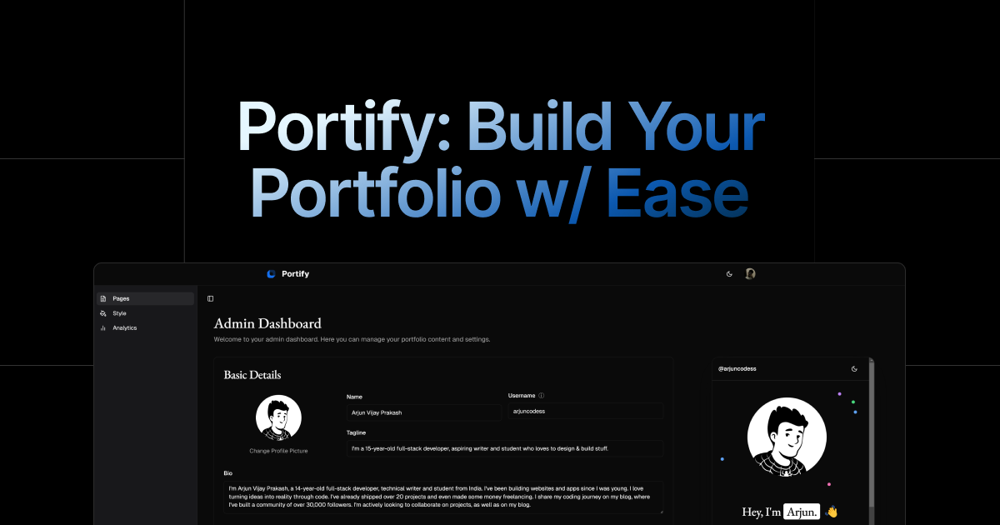
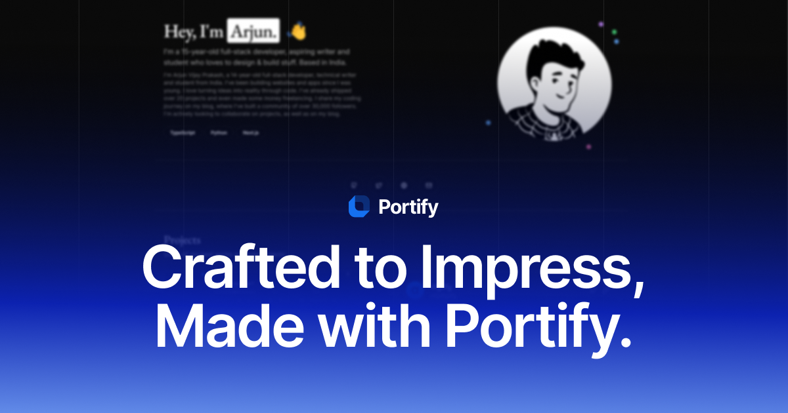
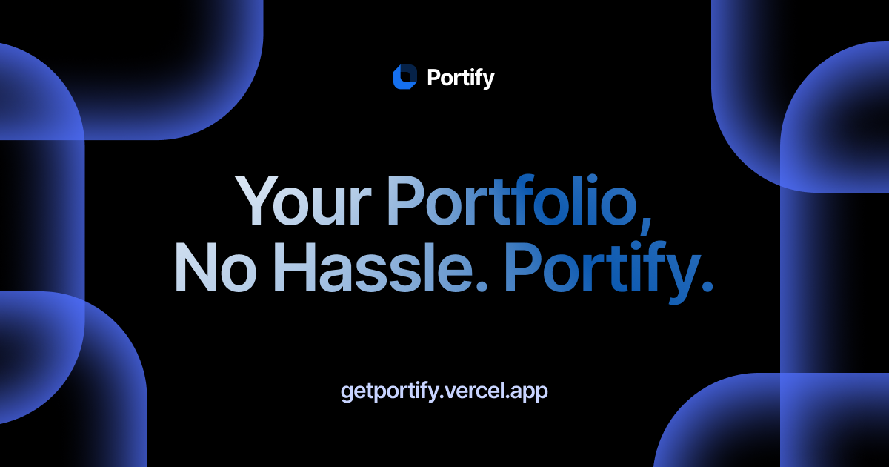

# Portify 📑

## **TL;DR:**

Portify is the fastest, easiest way to create a stunning portfolio in minutes.

1. Choose from customizable templates, themes, and fonts.
2. Track link clicks and profile visits with built-in analytics.
3. No coding required – just sign up, customize, and share your work with the world!  

---

## 🚀 What is Portify?  

Portify is a tool designed to help creators, developers, designers, and anyone with something to showcase build a professional portfolio quickly and effortlessly.

I’ve built it to be intuitive, beautiful, and packed with features to make YOUR portfolio stand out.

---

## 🌟 Key Features  

### **1. Styles**  

Your portfolio should reflect your personality, and I’ve made sure you can customize every pixel of it:

#### **Themes**

Set the mood of your portfolio with color palettes that suit your style:  

- **Neutral**: Clean and classic.  
- **Ocean**: Cool blues for a calming vibe.  
- **Forest**: Refreshing greens inspired by nature.  
- **Sunset**: Warm and inviting tones.  
- **Rose**: Elegant pinks with a soft touch.  
- **Slate**: Sleek and modern grays.

Open a Github issue if you want me to add more themes :)

#### **Templates**  

Choose a layout that fits your content and aesthetic:  

- **Minimal**: Simple and focused.  
- **Pristine**: Crisp and professional.  
- **Vibrant**: Bold and dynamic.  
- **Elegant**: Sophisticated and stylish.  

#### **Fonts**  

Typography matters, so I’ve included a variety of fonts to suit any style:  

- **Heading Fonts**:  
  - EB Garamond  
  - Geist  
  - Inter  
  - Alegreya  
  - Montserrat  
  - Fraunces  

- **Content Fonts**:  
  - Geist  
  - Inter  
  - Newsreader  
  - IBM Plex Sans  
  - Work Sans  
  - Nunito  
  - Merriweather  
  - Lora

Again, open a Github issue if you want me to add more fonts :)

### **2. Built-In Analytics**  

Understanding your audience is key, so I’ve added analytics to help you track engagement:  

#### **Link Analytics**  

See how many people click on the links in your portfolio.
This is perfect for tracking interest in your projects, social media, or other important links.  

#### **Profile Visit Analytics**  

Get insights into how many people are visiting your portfolio and when.
Use this data to measure your portfolio’s reach and impact.  

### **3. Simple and Fast**  

I know how busy life can get, so I’ve made Portify incredibly easy to use. Here’s how simple it is:  

1. **Create a Profile**: Login/Sign up, go to /create and create your profile.
2. **Add Your Details & Customise Your Portfolio**: Provide the necessary information to complete your profile and customize your portfolio to every aspect.
3. **Share with Anyone**: Share your profile with anyone to showcase your work.

No coding, no hassle – just a beautiful portfolio in minutes.

### **4. User-Friendly Customization**

I’ve designed Portify so anyone can create a unique portfolio, even if you’ve never built a website before. With an intuitive interface, you can:  

- Swap templates instantly.  
- Change fonts and colors effortlessly.  
- Preview your changes in real-time.  

### **5. Mobile-Friendly Design**  

Your portfolio will look great on any device – desktops, tablets, or phones. I’ve ensured every template is responsive and optimized for all screen sizes.  

### **6. Shareable and Professional**  

Once your portfolio is ready, you’ll get a clean, shareable link that you can add to your email signature, social media bios, or resumes.  

### **7. Who Is Portify For?**  

Portify is for anyone who wants to showcase their work (projects and skills) in a professional way. Here are some examples of who Portify is perfect for:  

- **Developers**: Highlight your projects, GitHub repos, and tech stack.  
- **Designers**: Display your creative work with stunning visuals.  

---

## 💡 How It Works  

1. **Sign Up**: Go to [Portify](https://getportify.vercel.app/), create an account and head towards /create to create your portfolio.  
2. **Pick a Template**: Choose from four beautiful designs.  
3. **Customize**: Add your details, select fonts, and tweak colors.  
4. **Publish**: Your portfolio is live! Share it with anyone, anywhere.  

---

## 🔗 Links  

- **Teaser**: [https://dub.sh/portify-teaser](https://dub.sh/portify-teaser)  
- **Check out the code**: [https://github.com/ArjunCodess/portify](https://github.com/ArjunCodess/portify)  
- **Live link**: [https://getportify.vercel.app/](https://getportify.vercel.app/)  

---

## 💬 Feedback  

I’d love to hear what you think! If you have ideas, suggestions, or run into any issues, feel free to:  

- Open an issue on GitHub.
- Email me at **arjunv.prakash12345@gmail.com**.  

---

Thank you for using Portify. I can’t wait to see the amazing portfolios you create!
